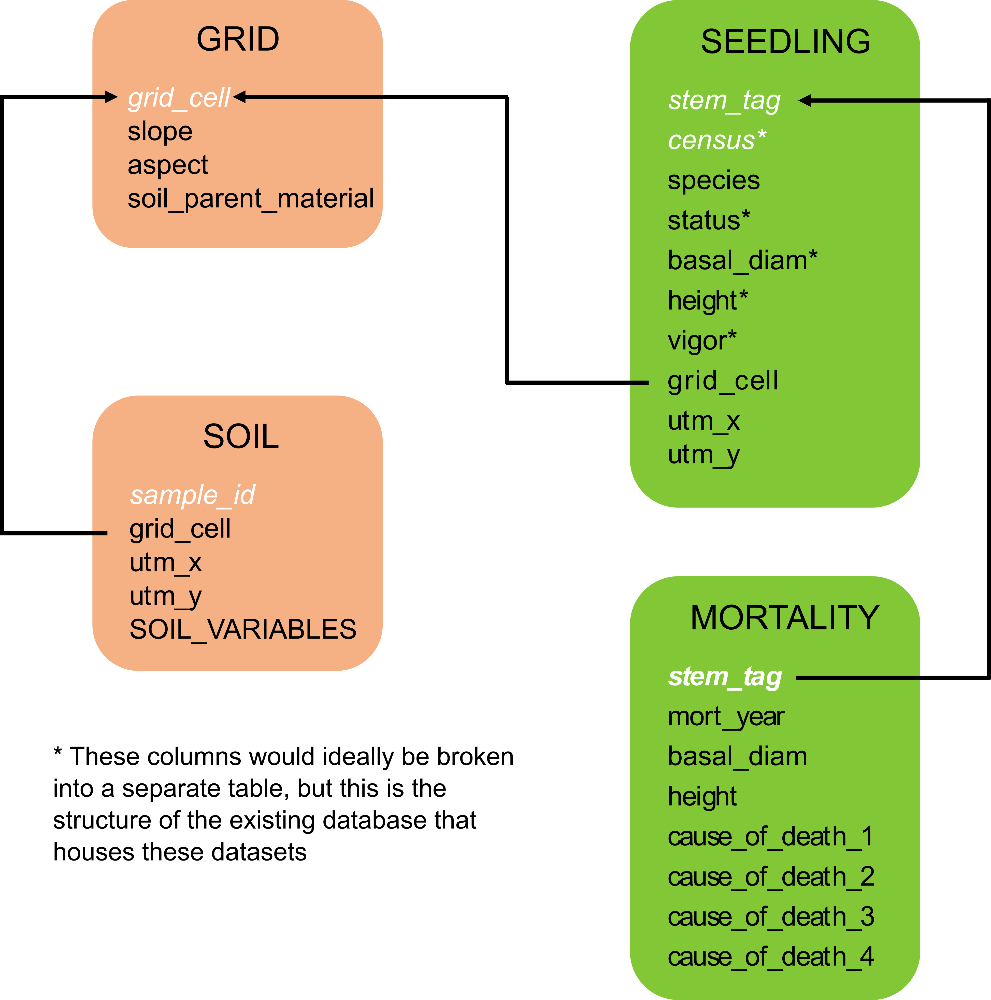

# Data Description
For this project, I will be using data collected on _Pinus_ seedlings within the Utah Forest Dynamics Plot ([UFDP](http://www.ufdp.org)) in Cedar Breaks National Monument, UT. The plot is home to a significant population of old-growth bristlecone pine (*Pinus longaeva*) and another high-elevation pine species, _Pinus flexilis_. I would like to investigate some potential relationships between the seedlings and their abiotic environments as well as spatial patterns among seedlings. 

The 15 ha plot is set up on a 20-m grid and all _Pinus_ seedlings are mapped, tagged, and censused annually for mortality. The physical environment of this plot is also well-documented, with data to construct complete topographical and soil profiles at the level of the grid cell (referred to as "quadrats").

the data is contained in 4 tables sinplified below:


```{r image, echo=FALSE, fig.align='center', out.width='75%'}

```

* `Seedling` contains data on individual seedlings and their demographic data. It is organized with a composite primary key of STEM_TAG and CENSUS, and thus has multiple measurements for each individual seedling associated with a unique STEM_TAG. *NOTE: this is not the most efficient structure, but I am working within constraints of existing workflows that are set up this way.*
* `Mortality` contains measurement and mortality data associated with a seedling when it dies. It is uniquely identified by STEM_TAG and seedlings are only present in this table after they have died.
* `Grid` contains positional/topographical data about each quadrat within the plot grid. It is uniquely identified by QUADRAT (grid_cell).
* `Soil` contains data on individual soil chemical measurements from samples takent throughout the plot. It is uniquely identified by SAMPLE_ID and relates back to `Grid` by what QUADRAT the sample was taken in.

The data presented here are a small subset of the entire data workflow of the plot, and there is an existing SQL database structure and regular updates to upstream data, so the database inherits some peculiarities as a result of removing the seedlings from the context of all the adult trees.


# Database Creation
## Initialization
```{r package_load, message=F}
library(tidyverse)
library(DBI)
library(RSQLite)
```


## Import Data
```{r import}
## Load tabular data

#Seedling table
seed.raw = read.csv(paste0('./Data_raw/',max(dir('./Data_raw')[grepl(dir('./Data_raw/'),pattern = 'Seedling')])),na.strings='NULL')
#Mortality table
mort.raw = read.csv(paste0('./Data_raw/',max(dir('./Data_raw')[grepl(dir('./Data_raw/'),pattern = 'Mort_')])),na.strings='NULL')
#Soil table
soil = read.csv(paste0('./Data_raw/',max(dir('./Data_raw')[grepl(dir('./Data_raw/'),pattern = 'Soil')])),na.strings='NULL') %>%
       dplyr::select(-SAMPLE_NUM) %>%
       filter(!SAMPLE_ID %in% c('P1','P2','P3','P4','P5','P6')) %>%
       dplyr::rename(`BOTTLE&KCL` = BOTTLE.KCL,
                     `BOTTLE&KCL&SOIL` = BOTTLE.KCL.SOIL,
                     `DRY_SOIL&PAN` = DRY_SOIL.PAN)
#Grid table
grid.poly = read.csv(paste0('./Data_raw/',max(dir('./Data_raw')[grepl(dir('./Data_raw/'),pattern = 'Grid_Poly')])),na.strings='NULL')
```


## Create Database
Establishing a connection to a new SQLite database to house the datasets.
```{r connect, eval=FALSE}
seedling.db = dbConnect(RSQLite::SQLite(), "./Data_raw/seedlings.db")
```

Creating the "Grid" table... I don't actally have some of this data generated yet (SLOPE, ASPECT, SOIL_PARENT_MATERIAL).
```{r create_grid, eval=FALSE}
dbExecute(seedling.db, 
"CREATE TABLE Grid (
 QUADRAT char(3) NOT NULL,
 SLOPE double(5,2),
 ASPECT double(6,2),
 SOIL_PARENT_MATERIAL char(4),
 SW_POINT	char(3) NOT NULL,
 SW_UTM_X	double(8,2) NOT NULL,
 SW_UTM_Y	double(9,2) NOT NULL,
 NW_POINT	char(3) NOT NULL,
 NW_UTM_X	double(8,2) NOT NULL,
 NW_UTM_Y	double(9,2) NOT NULL,
 NE_POINT	char(3) NOT NULL,
 NE_UTM_X	double(8,2) NOT NULL,
 NE_UTM_Y	double(9,2) NOT NULL,
 SE_POINT	char(3) NOT NULL,
 SE_UTM_X	double(8,2) NOT NULL,
 SE_UTM_Y double(9,2) NOT NULL,
 PRIMARY KEY (QUADRAT)
);")
```

Creating the "Seedling" table... a lot of this stuff will probably go unused.
```{r create_seed, eval=FALSE}
dbExecute(seedling.db, 
"CREATE TABLE Seedling (
 STEM_TAG char(7) NOT NULL DEFAULT '',
 TREE_TAG char(7) NOT NULL,
 CENSUS int(2) NOT NULL,
 DATE char(8) NOT NULL,
 QUADRAT char(3) NOT NULL,
 SPECIES varchar(8) NOT NULL,
 DBH double(4,1) DEFAULT NULL,
 DBH_YEAR int(4) NOT NULL,
 STATUS int(2) DEFAULT '0' NOT NULL,
 VIGOR int(1) DEFAULT '',
 DA varchar(3) DEFAULT NULL,
 MORT_DATE int(4) DEFAULT NULL,
 DOG_DATE int(4) DEFAULT NULL,
 SC int(1) DEFAULT '',
 SNAG_HEIGHT double(4,2) DEFAULT NULL,
 SNAG_TD double(3,1) DEFAULT NULL,
 RELATIVE_PLOT_X double(5,2) DEFAULT NULL,
 RELATIVE_PLOT_Y double(5,2) DEFAULT NULL,
 SEEDLING_BASAL_DIAM double(4,2) DEFAULT NULL,
 SEEDLING_HEIGHT double(3,2) DEFAULT NULL,
 LEANER_ANGLE int(3) DEFAULT NULL,
 BT varchar(2),
 DT varchar(2),
 RT varchar(2),
 SCAR varchar(2),
 FRASS varchar(2),
 PITCH varchar(2),
 EE varchar(2),
 MT varchar(2),
 CONK varchar(16),
 NEC varchar(2),
 FLAG varchar(2),
 SWELL varchar(2),
 SPRT varchar(9),
 BFB varchar(2) DEFAULT NULL,
 OTHER_CODES varchar(20),
 OTHER_HOM double(3,2) DEFAULT NULL,
 DIRECTION char(4) DEFAULT NULL,
 NW char(1) DEFAULT NULL,
 FIELD_X double(5,2) DEFAULT NULL,
 FIELD_Y double(5,2) DEFAULT NULL,
 REFERENCE varchar(7) DEFAULT NULL,
 DISTANCE double(4,2) DEFAULT NULL,
 AZIMUTH double(4,1) DEFAULT NULL,
 PLOT_X double(5,2) DEFAULT NULL,
 PLOT_Y double(5,2) DEFAULT NULL,
 UTM_X double(8,2) DEFAULT NULL,
 UTM_Y double(9,2) DEFAULT NULL,
 UTM_Z double(6,2) DEFAULT NULL,
 REMAPPING varchar(80),
 PREVIOUS_TAGS varchar(24) DEFAULT NULL,
 COMMENT varchar(255) DEFAULT NULL,
 PLOT varchar(4) DEFAULT NULL,
 FIELD_1 varchar(20) NOT NULL,
 FIELD_2 varchar(20) DEFAULT NULL,
 FIELD_3 varchar(20) DEFAULT NULL,
 FIELD_4 varchar(20) DEFAULT NULL,
 FIELD_5 varchar(20) DEFAULT NULL,
 DATA_ENTRY_1 varchar(20) DEFAULT NULL,
 DATA_ENTRY_2 varchar(20) DEFAULT NULL,
 DATA_CHECK varchar(20) DEFAULT NULL,
 CTFS_DA char(1),
 UPDATED char(8) DEFAULT NULL,
 DNA char(8) DEFAULT NULL,
 CORED int(4) DEFAULT NULL,
 COOKIE int(4) DEFAULT NULL,
 EST_ESTABLISHMENT int(9) DEFAULT NULL,
 DATABASE_HISTORY varchar(240) NOT NULL,
 PRIMARY KEY (STEM_TAG,CENSUS)
 
 CONSTRAINT Tree_ibfk_14 FOREIGN KEY (QUADRAT) REFERENCES Grid (QUADRAT)
);")
```

Creating "Soil" table.
```{r create_soil, eval=FALSE}
dbExecute(seedling.db, 
"CREATE TABLE Soil (
 SAMPLE_ID varchar(5) NOT NULL,
 QUADRAT char(3) NOT NULL,
 TYPE varchar(16) NOT NULL DEFAULT '',
 UTM_X double(8,2) DEFAULT NULL,
 UTM_Y double(9,2) DEFAULT NULL,
 DESCRIPTION varchar(80) NOT NULL,
 FIELD_COMMENTS varchar(80) DEFAULT NULL,
 SURVEY_YEAR char(4) NOT NULL,
 `BOTTLE&KCL` double(5,2) DEFAULT NULL,
 `BOTTLE&KCL&SOIL` double(5,2) DEFAULT NULL,
 EMPTY_PAN double(4,2) DEFAULT NULL,
 FRESH_SOIL double(5,2) DEFAULT NULL,
 `DRY_SOIL&PAN` double(5,2) DEFAULT NULL,
 DRY_SOIL double(5,2) DEFAULT NULL,
 DRY_WT double(5,2) DEFAULT NULL,
 DRY_SOIL_IN_KCL double(5,2) DEFAULT NULL,
 SOLUTION_VOL double(5,2) DEFAULT NULL,
 NH4_mg_N_per_L double(5,2) DEFAULT NULL,
 NO3_mg_N_per_L double(5,2) DEFAULT NULL,
 pH_water double(3,2) DEFAULT NULL,
 pH_CaCl2 double(3,2) DEFAULT NULL,
 pH_BaCl2 double(3,2) DEFAULT NULL,
 BrayP_mg_per_kg double(7,4) DEFAULT NULL,
 NH4_mgN_per_kg double(6,4) DEFAULT NULL,
 NO3_mgN_per_kg double(6,4) DEFAULT NULL,
 Inorg_N_mgN_per_kg double(6,4) DEFAULT NULL,
 Al_mg_per_kg double(7,4) DEFAULT NULL,
 Ca_mg_per_kg double(7,2) DEFAULT NULL,
 Fe_mg_per_kg double(6,4) DEFAULT NULL,
 K_mg_per_kg double(7,2) DEFAULT NULL,
 Mg_mg_per_kg double(7,2) DEFAULT NULL,
 Mn_mg_per_kg double(7,4) DEFAULT NULL,
 Na_mg_per_kg double(7,4) DEFAULT NULL,
 Al_cmolc_per_kg double(5,4) DEFAULT NULL,
 Ca_cmolc_per_kg double(7,4) DEFAULT NULL,
 Fe_cmolc_per_kg double(5,4) DEFAULT NULL,
 K_cmolc_per_kg double(5,4) DEFAULT NULL,
 Mg_cmolc_per_kg double(6,4) DEFAULT NULL,
 Mn_cmolc_per_kg double(5,4) DEFAULT NULL,
 Na_cmolc_per_kg double(5,4) DEFAULT NULL,
 TEB_cmolc_per_kg double(6,3) DEFAULT NULL,
 ECEC_cmolc_per_kg double(6,3) DEFAULT NULL,
 Base_sat_percent double(6,3) DEFAULT NULL,
 Al_sat_percent double(6,3) DEFAULT NULL,
 Ca_to_Mg_ratio double(6,3) DEFAULT NULL,
 PRIMARY KEY (SAMPLE_ID)
)"
)
```

Creating "Mortality" table.
```{r create_mort, eval=FALSE}
dbExecute(seedling.db,
"CREATE TABLE Mortality (
 STEM_TAG char(7) NOT NULL,
 QUADRAT char(3) NOT NULL,
 SPECIES varchar(8) NOT NULL,
 DATE char(8) NOT NULL,
 CENSUS int(2) NOT NULL,
 DBH decimal(4,1) DEFAULT NULL,
 ROOT int(1) DEFAULT NULL,
 STEM int(1) DEFAULT NULL,
 SNAG_HEIGHT decimal(4,2) DEFAULT NULL,
 SNAG_TD double(2,0) DEFAULT NULL,
 CROWN_P int(3) DEFAULT NULL,
 TREE_P int(3) DEFAULT NULL,
 ANGLE int(3) DEFAULT NULL,
 GROUND_P int(3) DEFAULT NULL,
 SUPPORT_P int(3) DEFAULT NULL,
 CC1 varchar(2) DEFAULT NULL,
 CC2 varchar(2) DEFAULT NULL,
 CC3 varchar(2) DEFAULT NULL,
 CC4 varchar(2) DEFAULT NULL,
 CC5 varchar(2) DEFAULT NULL,
 FAD1 varchar(5) NOT NULL DEFAULT '0',
 FAD2 varchar(5) NOT NULL DEFAULT '0',
 FAD3 varchar(5) NOT NULL DEFAULT '0',
 FAD4 varchar(5) NOT NULL DEFAULT '0',
 FAD5 varchar(5) NOT NULL DEFAULT '0',
 COMMENT varchar(400) DEFAULT NULL,
 DALB_DATE varchar(9) DEFAULT NULL,
 FIELD_1 varchar(20) DEFAULT NULL,
 FIELD_2 varchar(20) DEFAULT NULL,
 FIELD_3 varchar(20) DEFAULT NULL,
 FIELD_4 varchar(20) DEFAULT NULL,
 FIELD_5 varchar(20) DEFAULT NULL,
 DATA_ENTRY_1 varchar(20) DEFAULT NULL,
 DATA_ENTRY_2 varchar(20) DEFAULT NULL,
 DATA_CHECK_1 varchar(20) DEFAULT NULL,
 DATA_CHECK_2 varchar(20) DEFAULT NULL,
 UPDATED char(8) NOT NULL,
 PRIMARY KEY (STEM_TAG),
 CONSTRAINT Mortality_ibfk_1 FOREIGN KEY (STEM_TAG) REFERENCES Seedling (STEM_TAG),
 CONSTRAINT Mortality_ibfk_17 FOREIGN KEY (QUADRAT) REFERENCES Grid (QUADRAT)
);"
)
```

Now we want to fill the empty database with data.
```{r fill, eval=FALSE}
dbWriteTable(seedling.db, "Grid", grid.poly, append = TRUE)
dbWriteTable(seedling.db, "Seedling", seed.raw, append = TRUE)
dbWriteTable(seedling.db, "Mort", mort.raw, append = TRUE)
dbWriteTable(seedling.db, "Soil", soil, append = TRUE)
```

And we now have a functioning SQL database created in R!


